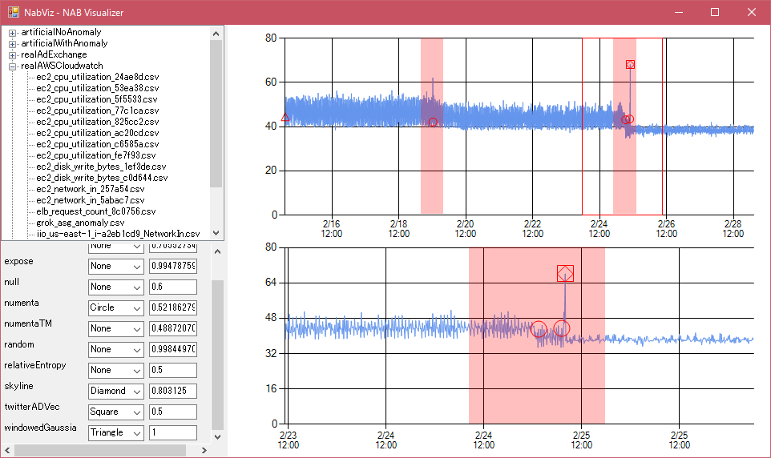

# NabViz
A visualization tool for Numenta Anomaly Benchmark (NAB).



You can choose which detector to draw and change each theshold with GUI, zoom in a partcular area using mouse wheel.

## Requirements
- .NET 4.5
- Json.NET


## How to use
This application assumes the following directory structure.

```
├─bin
├─data
├─labels
└─results
```

Since NabViz is a tool only for visualization, you must download the raw data, the anomaly labels, and the calculated results from [the official NAB page](https://github.com/numenta/NAB), and put them in the same manner as the original NAB repository.

Don't forget to put your binary in the `bin` directory.


